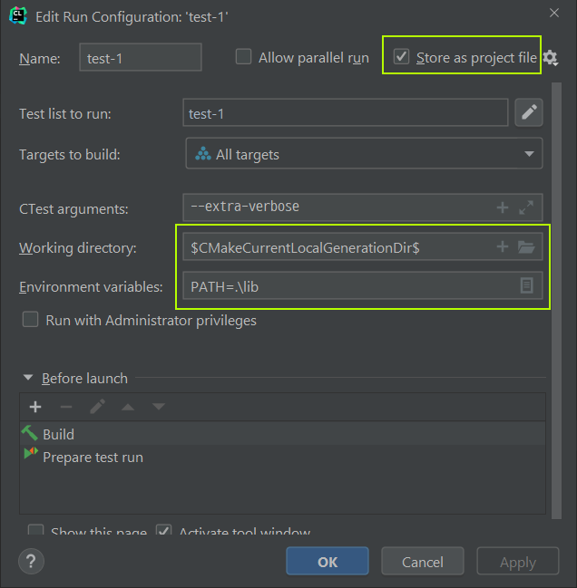

## CMake 프로젝트 ctest 테스트

* ctest를 어떻게 사용하는지 궁금해서 예제 따라서 진행해봄.
* CLion 에서 CMake 프로젝트 생성해서 진행
* 메인 프로그램 / 공유 라이브러리 / 테스트 3가지로 구성되어있는데, 
  실행시 공유라이브러리가 존재하는 경로가 PATH에 포함되야하여, 
  Run Configuration 들을 Project File로 저장했다.
  * 관련된 CLion 프로젝트 파일은 아래와 같음.
    * .idea/runConfigurations
      * hello.xml
      * test_1.xml ~ test_3.xml

        

